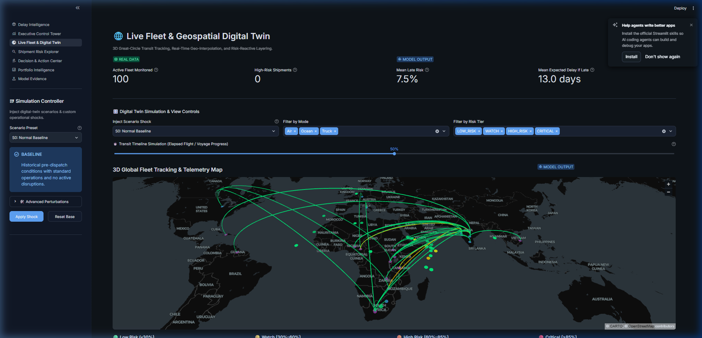
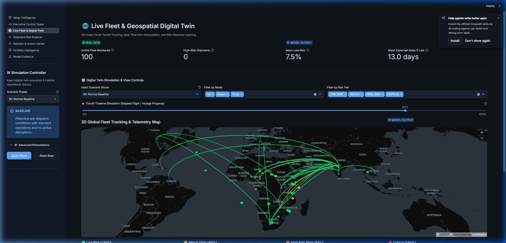
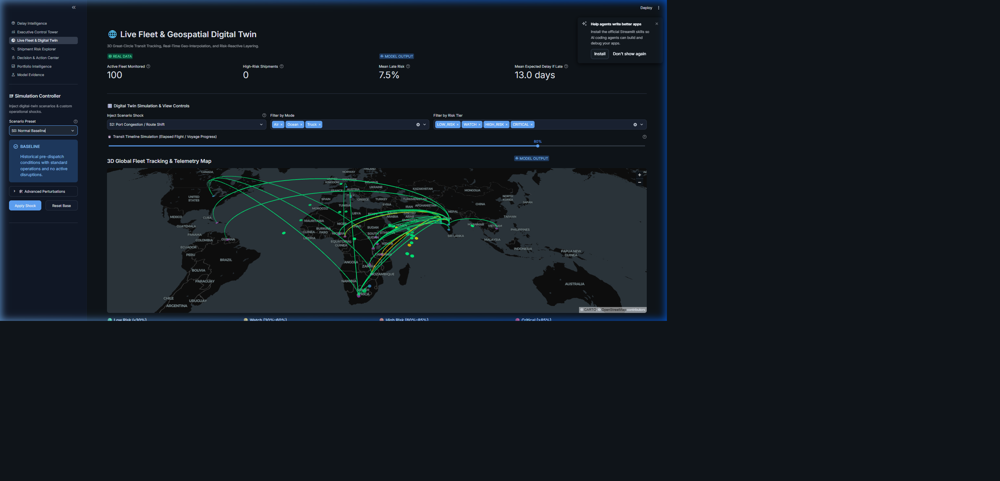
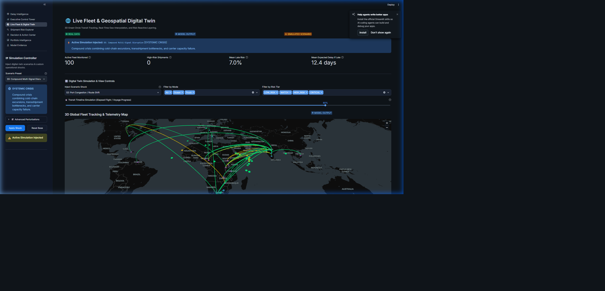
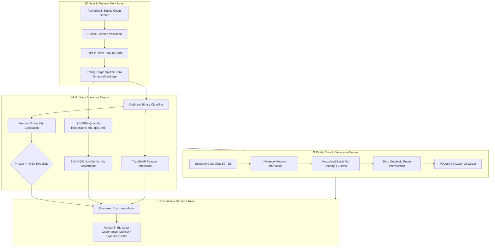

<div align="center">

# 🌐 ORCA: Operational Risk & Cost Analytics
### **Decision-Intelligence Platform & Geospatial Digital Twin for Pharmaceutical Supply Chains**

[](https://www.python.org/)
[](https://fastapi.tiangolo.com/)
[](https://streamlit.io/)
[](https://deckgl.readthedocs.io/)
[](https://arxiv.org/abs/1905.03222)
[](https://pytest.org/)
[](https://opensource.org/licenses/MIT)

<p align="center">
  <b>Real-Time Delay Prediction</b> • 
  <b>Calibrated Risk Probabilities</b> • 
  <b>CQR Uncertainty Intervals</b> • 
  <b>TreeSHAP Attribution</b> • 
  <b>3D Geospatial Tracking</b> • 
  <b>Counterfactual Scenarios</b>
</p>

</div>

---

## 📌 Executive Overview

**ORCA** (*Operational Risk & Cost Analytics*) is a production-grade decision-intelligence platform and digital twin designed to mitigate delays and optimize logistics interventions across complex global pharmaceutical supply lines (modeled on the USAID | DELIVER PROJECT / SCMS dataset).

Traditional supply chain systems rely on static threshold alerts or point-estimate forecasts that conceal uncertainty. **ORCA** combines a rigorous, leak-free **13-stage ML pipeline** with **distribution-free conformal prediction (CQR)**, **local TreeSHAP explainability**, **prescriptive economic decision rules**, and an interactive **3D Geospatial Digital Twin**.

---

## 📸 Interactive Control Tower Windows

### 1. 🌐 Live Fleet & Geospatial Digital Twin
*Real-time great-circle transit tracking, geodesic position interpolation ($\text{Slerp}$), risk-reactive arc coloring, and telemetry anomaly offsets ($S_1 \dots S_6$).*



---

### 2. 📊 Executive Control Tower
*Dynamic portfolio overview, calibrated late-risk histograms, risk-tier allocations, and prioritized intervention queues.*



---

### 3. 🔍 Shipment Risk Explorer
*Deep-dive shipment inspection, calibrated probability, 90% conditional delay prediction intervals, and local TreeSHAP attribution waterfall.*



---

### 4. ⚖️ Decision & Action Center
*Prescriptive policy recommendations, avoidable delay cost calculations, intervention cost-benefit tradeoffs, and human-in-the-loop governance.*



---

## 🧠 Architectural Framework & Scientific Pipeline



---

## 🚀 Key Innovations & Methodological Rigor

### 1. 🎯 Calibrated Classification & Conformal Uncertainty (CQR)
- **Calibrated Binary Delay Risk**: CatBoost classifier transformed through monotonic Isotonic Regression to ensure predicted probabilities match true empirical event frequencies.
- **Conditional Delay Severity**: LightGBM quantile regression optimizing pinball loss for quantiles $\tau \in \{0.05, 0.50, 0.95\}$ conditional on late arrival.
- **Distribution-Free Coverage Guarantee**: Conformalized Quantile Regression (CQR) applies finite-sample non-conformity adjustments ($\hat{q}_{\text{adj}} = 8.87\text{ days}$), mathematically guaranteeing $90\%$ empirical coverage under temporal exchangeability:
  $$\hat{C}(x) = \left[ \hat{q}_{0.05}(x) - \hat{q}_{\text{adj}}, \; \hat{q}_{0.95}(x) + \hat{q}_{\text{adj}} \right]$$

### 2. 🎛️ Digital Twin Reactive Simulation ($S_0 \dots S_6$)
Mutate active fleet characteristics in-memory and re-score the entire 100-shipment cohort in $< 200\text{ms}$:
| Scenario ID | Name | Operational Perturbation Injected |
| :--- | :--- | :--- |
| **$S_0$** | **Normal Baseline** | Pristine historical holdout conditions. |
| **$S_1$** | **Cold-Chain Excursion** | Temperature spike ($>8.5^\circ\text{C}$) + $15\%$ vendor risk boost. |
| **$S_2$** | **Port Congestion** | $+30\%$ scheduled transit days + $25\text{km}$ route deviation. |
| **$S_3$** | **Customs Slowdown** | $+5.0$ days added directly to border lead time. |
| **$S_4$** | **Carrier Capacity Shock** | $+10.0$ days lead time surge + $25\%$ vendor risk increase. |
| **$S_5$** | **Compound Disruption** | Multi-signal crisis combining cold-chain, deviation, and carrier shocks. |
| **$S_6$** | **Post-Intervention Recovery** | Expedited routing ($-3.0$ days) + $20\%$ supplier risk reduction. |

### 3. 🌐 3D Geospatial PyDeck Tracking Engine
- **Great-Circle Slerp Interpolation**:
  $$\mathbf{p}(\alpha) = \frac{\sin((1-\alpha)c)}{\sin(c)} \mathbf{p}_{\text{orig}} + \frac{\sin(\alpha c)}{\sin(c)} \mathbf{p}_{\text{dest}}$$
- **Risk-Coded Chromatic Scale**:
  - 🟢 `LOW_RISK` ($\le 30\%$): `[0, 230, 118, 200]`
  - 🟡 `WATCH` ($30\% - 60\%$): `[255, 214, 0, 200]`
  - 🟠 `HIGH_RISK` ($60\% - 85\%$): `[255, 145, 0, 220]`
  - 🔴 `CRITICAL` ($> 85\%$): `[255, 23, 68, 255]`

---

## 💻 Tech Stack & Dependencies

- **Languages & Runtimes**: Python 3.10+
- **Machine Learning**: CatBoost, LightGBM, Scikit-Learn, SHAP, Optuna
- **Geospatial & Visualization**: PyDeck (Deck.gl), Plotly, Streamlit
- **Serving & APIs**: FastAPI, Pydantic v2, Uvicorn
- **Data Engineering**: Pandas, NumPy, PyArrow (Parquet)
- **Quality & Safety Assurance**: Pytest, Typeguard, Pandera

---

## 🛠️ Quickstart & Installation

### 1. Clone & Environment Setup
```bash
git clone https://github.com/ahmedzogly/ORCA-Supply-Chain-Delay-Intelligence.git
cd ORCA-Supply-Chain-Delay-Intelligence

# Create and activate virtual environment
python -m venv .venv
# Windows:
.venv\Scripts\activate
# Linux / macOS:
source .venv/bin/activate

# Install dependencies and package in editable mode
pip install -e .
```

### 2. Launch the Streamlit Control Tower
```bash
streamlit run src/delay_intelligence/dashboard/app.py
```
Open **[http://localhost:8501](http://localhost:8501)** in your browser.

### 3. Launch the FastAPI Serving API
```bash
uvicorn delay_intelligence.api.main:app --host 127.0.0.1 --port 8000 --reload
```
Interactive OpenAPI documentation is available at **[http://127.0.0.1:8000/docs](http://127.0.0.1:8000/docs)**.

### 4. Execute Full Verification Test Suite
```bash
pytest tests/ -v
```
*Current test suite status: **664 passed, 6 skipped, 0 failures** (100% integrity).*

---

## ⚖️ Scientific Guardrails & Governance

> [!NOTE]
> **Observational Data Disclaimer**: Historical SCMS supply chain records lack randomized treatment assignments. Model predictions represent statistical associations; SHAP values explain model attribution, not physical causation; exploratory graph edges are hypotheses; and simulated recommendations are decision-support estimates.

- **Non-Invasive Verification**: Model registries (`artifacts/model_registry/v2/`) and pre-freeze manifests are cryptographically locked via SHA-256 hashes.
- **Human-in-the-Loop Decision Gates**: Interventions flagged as `HIGH_RISK` or `CRITICAL` require mandatory human approver sign-off before dispatching carrier expedites.

---

## 📄 License & Attribution

Distributed under the **MIT License**. Built with research rigor for public health supply chains and advanced decision intelligence.
